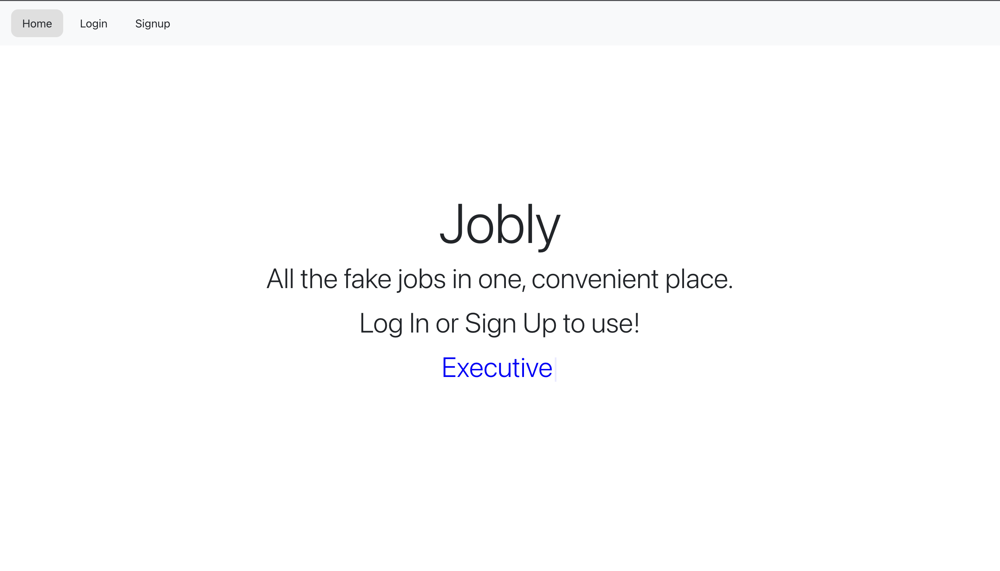
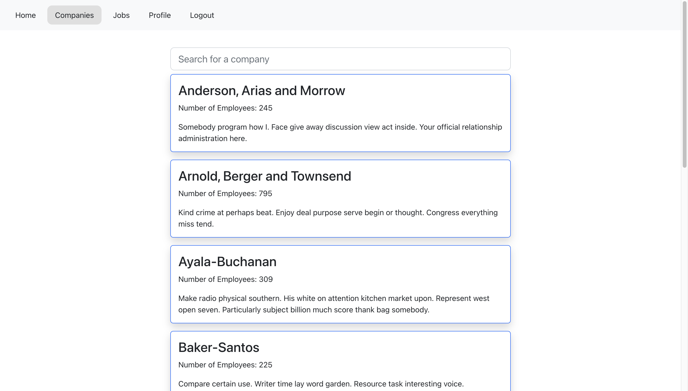
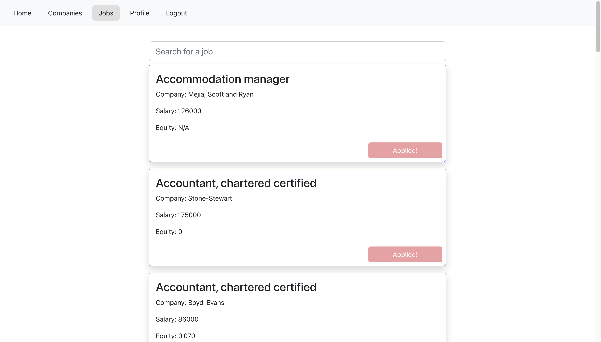
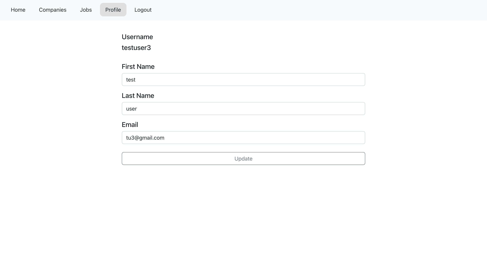

# Jobly (Frontend)

The frontend portion of the fullstack app Jobly - the #1 website to find and apply to fake jobs! Make an account, browse for companies, search through job listings, and apply to jobs.

The fullstack app is deployed here: https://tk-jobly.surge.sh/

Frontend: React, Reactstrap 
Backend: Node, Express, PostgreSQL

## Homepage

Create an account or login.

## Companies page

Browse companies - click to see each company's job listings.

## Jobs page

Browse jobs and click to apply.

## Profile page

Update profile information.

